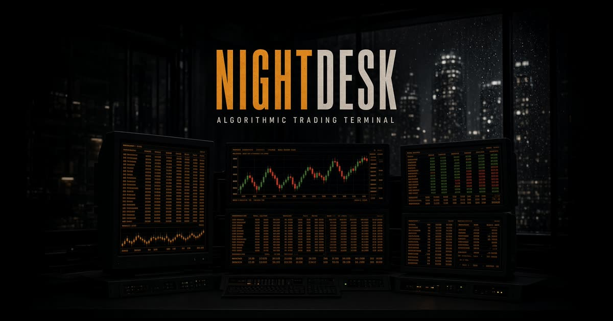
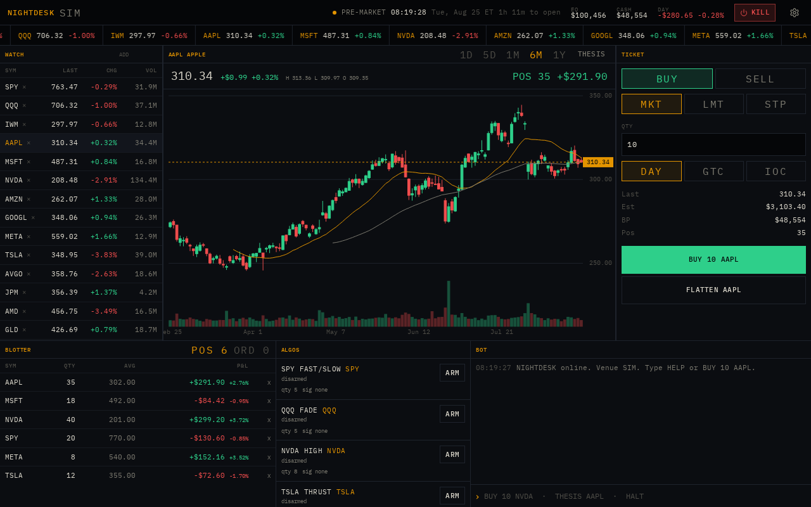

# NIGHTDESK

**Algorithmic trading terminal.**

Open [nightdesk.pmcclel.land](https://nightdesk.pmcclel.land).

A dark-room desk for watching tape, charting, sending orders, and arming simple algos. Starts in **SIM** with a seeded book and delayed quotes. Point it at **Alpaca paper** or **Alpaca live** from settings when you have keys.





## Desk

- **Tape** — scrolling last/change for the watchlist
- **Watch** — last, change, volume; click a symbol to load the chart
- **Chart** — candles with SMA overlays, 1D / 5D / 1M / 6M / 1Y
- **Ticket** — market, limit, stop; DAY / GTC / IOC; flatten
- **Blotter** — positions and working orders
- **Algos** — SMA cross, mean reversion, breakout, momentum; arm or disarm per symbol
- **Bot** — floor-broker commands, or natural language to Grok

On a phone the same panels are tabs: Tape, Chart, Trade, Book, Bot.

## Venues

| Venue | What it does |
| --- | --- |
| Simulation | Local blotter, Yahoo delayed tape, seed quotes if the tape is down |
| Alpaca Paper | Paper orders + Alpaca IEX tape |
| Alpaca Live | Real capital, same IEX tape as paper |

API keys stay in this browser and go only to Alpaca through the app proxy. They are not stored on the server. Kill in the header (or `HALT`) stops algos and new orders.

## Bot

Type in the bot console. Commands:

```
BUY 10 AAPL                 market buy
SELL 5 NVDA                 market sell
BUY 10 AAPL 185.5           limit buy
STOP SELL 10 AAPL 170       stop sell
BUY AAPL $2500              notional market
FLATTEN AAPL | FLATTEN ALL
CANCEL ALL
ARM sma-spy | DISARM sma-spy
THESIS NVDA
WATCH ADD AMD | WATCH RM AMD
HALT | RESUME | STATUS | HELP
```

Anything that is not a command is sent to Grok as a terse desk copilot. **Thesis** on the chart header asks for a short take on the selected symbol.

## Shortcuts

| Key | Action |
| --- | --- |
| `F` | Focus / unfocus the chart |
| `Shift+F` | Fullscreen the desk |
| `Esc` | Exit focus or fullscreen |

## Stack

- [React 19](https://react.dev/) + [TanStack Start](https://tanstack.com/start) / Router
- [Vite](https://vite.dev/) + [Tailwind CSS v4](https://tailwindcss.com/)
- Zustand (desk state, persisted in the browser)
- Alpaca REST through server functions; Yahoo as tape fallback
- Grok (xAI) for thesis and unmatched bot text

No accounts. SIM is local. Alpaca keys never leave the client except on proxied order/quote calls.

## Development

Requires **Node 22** and npm.

```bash
npm install
npm run dev
```

| Script | What it does |
| --- | --- |
| `npm run dev` | Local server with HMR |
| `npm run build` | Production bundle (Vercel) |
| `npm run typecheck` | `tsc --noEmit` |
| `npm test` | Node tests |
| `npm run lint` | ESLint |

## License

Private. All rights reserved.
